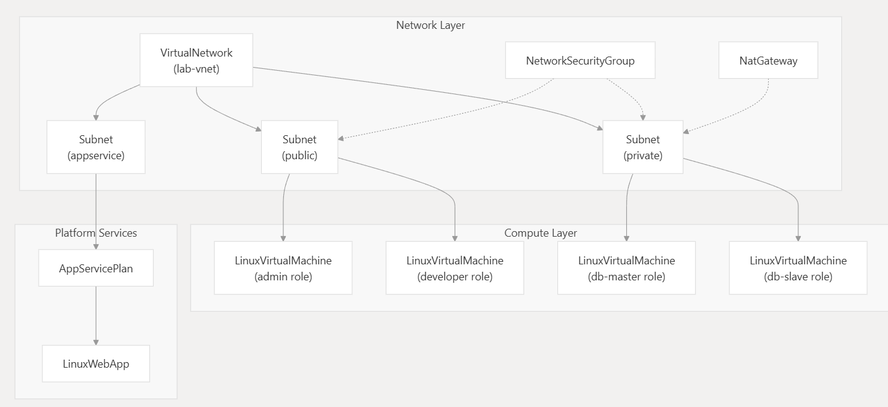
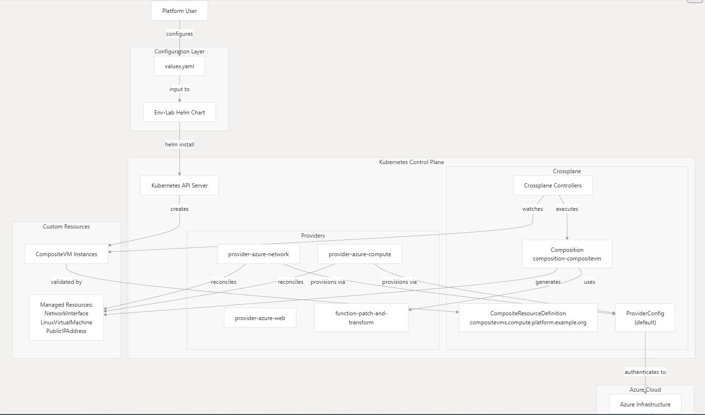

# Crossplane Lab: Deploy Azure Environments Like a Boss! 🚀☁️

<div align="center">
  
  <p><em>Behold the majestic lab infrastructure that Crossplane conjures from thin air! 🌟</em></p>
</div>

Ever dreamed of spinning up entire cloud labs with a single command, no manual portal-clicking nightmares? What if your infrastructure could self-heal, like a phoenix rising from the ashes of drift? Welcome to the **Crossplane Lab** – where YAML meets wizardry, and Kubernetes bosses around Azure like it's nobody's business! 🧙‍♂️

Picture this: You're a DevOps hero, sipping coffee while Crossplane conjures VMs, networks, and apps in Azure. No scripts, no sweat – just declare your desires, and poof! A full lab environment appears. And if something goes rogue (manual tweak, anyone?), Crossplane auto-fixes it. It's infrastructure as code, but make it epic. 🌟

This repo is your treasure map to mastering Crossplane with Azure. We'll build a complete lab: VMs for admin/developer/DB roles, secure networking (VNet, subnets, NSGs), NAT gateways, public IPs, and even an App Service for web fun. All wrapped in a Helm chart for easy deploys. GitOps-ready, reusable, and insanely cool. Ready to level up your cloud game? Let's dive in! 💻

## What's Inside This Magical Box? 🎁
- **Helm Chart (`Env-Lab/`)**: The core spellbook. Deploy with `helm install`, customize via `values.yaml`.
- **Crossplane Compositions**: Custom resources like `CompositeVM` to abstract Azure complexity. One YAML, many resources!
- **Providers**: Modular Azure providers (network, compute, web) for lean, fast provisioning.
- **Docs**: Step-by-step guides, from setup to deployment. Simple, detailed, and fun – no boring manuals here!
- **RBAC & XRD**: Permissions and API definitions for seamless K8s integration.

Key Features:
- **Multi-VM Setup**: Admin, developer, DB master/slave VMs with SSH access.
- **Networking Nirvana**: VNet, subnets, NSGs, NAT, public IPs – all automated.
- **App Services**: Linux Web App with plans for that extra web flair.
- **Drift Detection**: Crossplane watches and reconciles – no more "What happened?!" moments.
- **GitOps Friendly**: Version your infra, CI/CD it, and sleep soundly.

## Quick Start: Get Your Lab Running in Minutes! ⚡
1. **Prerequisites**: K8s cluster, Azure CLI, Helm. (Full setup in `docs/getting-ready.md`.)
2. **Install Crossplane & Providers**: Follow the getting-ready guide – it's like assembling a LEGO set.
3. **Customize**: Edit `Env-Lab/values.yaml` for your Azure sub, location, VM sizes, etc.
4. **Deploy**:
   ```bash
   helm install ndc-env-lab ./Env-Lab
   ```
5. **Watch Magic**: `kubectl get compositevms` – your VMs are born!
6. **Access**: SSH into public VMs, check Azure portal for resources.

Boom! Your lab is live. Modify and `helm upgrade` for tweaks. Uninstall to clean up – Crossplane handles the Azure teardown.

## Architecture: How the Sausage is Made 🏗️

<div align="center">
  
  <p><em>The magical architecture: From YAML to Azure reality! 🔮</em></p>
</div>

- **XRD (Composite Resource Definition)**: Defines `CompositeVM` – your custom API for VMs.
- **Composition**: Uses `patch-and-transform` to assemble NICs, VMs, and IPs from specs.
- **Helm Templating**: Generates multiple instances from `values.yaml`.
- **Providers**: Bridge to Azure APIs for provisioning.
- **RBAC**: Grants Crossplane permissions without overdoing it.

Think of it as a factory: You input specs, compositions process them, providers build in Azure. Self-managing and scalable!

## Benefits: Why Crossplane + K8s = Cloud Nirvana? 🌈
- **Abstraction**: Hide Azure's complexity. "I want a VM" – done. No 100-page docs.
- **Consistency**: Same patterns for all resources. No snowflake infra.
- **Reusability**: One chart, infinite labs. Clone for staging/prod.
- **Kubernetes Native**: Manage infra like apps – with `kubectl`, GitOps, and K8s tools.
- **Self-Healing**: Drift detection auto-corrects changes. Imperfect? Crossplane fixes it.
- **Limits?** Crossplane shines for multi-cloud, but Azure-specific features might need custom work. Still, it's a game-changer for declarative infra.

## Advanced Examples: Level Up Your Game 🧠
- **Custom Compositions**: Extend `CompositeVM` for databases or monitoring. Add patches for extra disks or tags.
- **GitOps Integration**: Use Flux to auto-deploy on repo changes. Infra as code, versioned like software!
- **Multi-Cloud Twist**: Swap Azure providers for AWS – same YAML, different clouds.
- **Monitoring**: Integrate Prometheus for resource metrics. Because who doesn't love dashboards?

<div align="center">
  
  <p><em>Unlock endless possibilities – from simple labs to enterprise empires! 🌍</em></p>
</div>

## Tutorials & Shoutouts 🙌
Huge thanks to the Crossplane community tutorials – they made this click for me! And the YouTube channels breaking down Crossplane/Azure integrations? Absolute gold. You know who you are – keep the awesome content coming! 📺🔥 Special shoutout to "The DevOps Toolkit" and "Crossplane's official channel" for the inspo.

## Links & Resources 🔗
- **Repo**: [Your GitHub Repo Link Here] – Star it if it blows your mind!
- **Docs**: Dive deep in `docs/` – what-is-crossplane, compositions, providers, deployment guides.
- **Crossplane Docs**: [crossplane.io](https://crossplane.io) – official wisdom.
- **Community**: Slack for questions, GitHub for issues.

## Contributing: Join the Fun! 🤝
Got ideas? Bugs? Enhancements? PRs welcome! Let's make this lab even more epic. Check issues for quests.

## License & Disclaimer 📜
MIT License. Use at your own risk – test in non-prod first. Azure costs apply; monitor your bill! 😅

## FAQ: Burning Questions Answered 🔥
- **Q: Can I use it with other clouds?** A: Absolutely – swap providers for AWS/GCP.
- **Q: What's the cost?** A: Free for Crossplane, but Azure resources add up. Use free tiers for testing.
- **Q: Stuck?** A: Docs first, then community. We're all learning!

<div align="center">
  
  <p><em>The workflow that turns dreams into deployed infra – pure magic! ✨</em></p>
</div>

Now go deploy that lab and conquer the cloud! If you build something cool, tag me. Questions? Docs or community got you. Onward! 🚀
